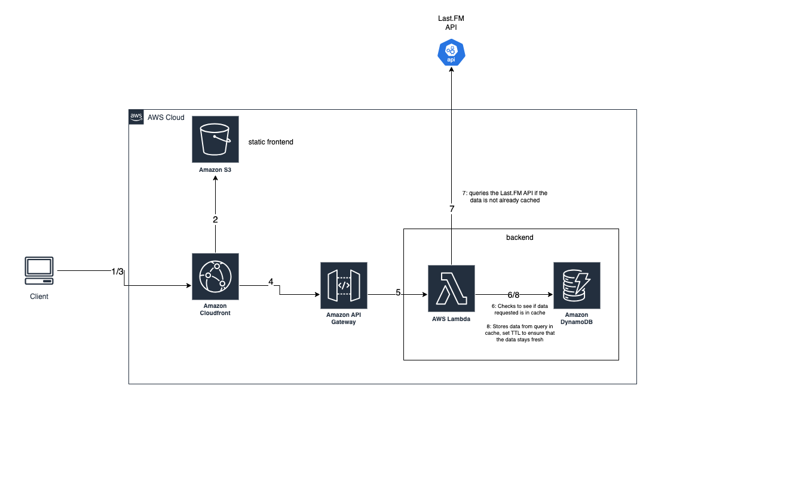

# Nuuly Front-End take home project

This project was built as a take-home assignment for Nuuly's interview process. Track Ninja displays data for the top artists of a country chosen by the user. The list of countries is generated via the [REST Countries API](https://restcountries.com/).

## Recommended IDE Setup

[VSCode](https://code.visualstudio.com/) + [Volar](https://marketplace.visualstudio.com/items?itemName=Vue.volar) (and disable Vetur).

## Customize configuration

See [Vite Configuration Reference](https://vite.dev/config/).

## Project Setup

```sh
pnpm install
```

### Compile and Hot-Reload for Development

```sh
npm run dev
```

### Compile and Minify for Production

```sh
npm run build
```

### Run Unit Tests with [Vitest](https://vitest.dev/)

```sh
npm run test:unit
```

In order to run queries locally you need to use a [Last.fm API key](https://www.last.fm/api/authentication). For the purpose of this short demo I decided to hard code my api key into this application. I would never do this under normal circumstances, however, I will leave it because this application should only be shared amongst a few people in Nuuly's hiring team.

You can add the API key that I provided via email [here](https://github.com/alex-davidson17/alex-nuuly-take-home/blob/2d8dd6ef0f5c6eb766ee2371b0d76f8697ee68cf/src/App.vue#L11).

Please note that this application is run entirely on the client side so your API key will be exposed when doing any queries.

## How this could scale

Track Ninja was built as a small proof of concept application and is not fit for production use and cannot handle large loads. To scale this I would:

- Move all queries over to an API for better performance/security. I would opt for an event-driven architecture.

- Cache the Last.fm API queries to boost performance. A NoSQL database is a good low-cost option for this. When a user searches for a country the serverless function would:
    1. Check the database (cache) to see if it exists there. If so, serve it to the user.
    2. If it is not in the cache - query the Last.fm API and serve the result to the user. Then store the result in our cache. Last.fm updates their charts weekly so we can make sure the cache stays fresh by setting a TTL (time-to-live) property on the object.

- Host the frontend. Since this is a static web app I would choose to configure an AWS S3 bucket for hosting and set it up with a CDN service such as Route 53.
- Store credentials in either a cloud-based secrets store (ex. AWS Secrets Manager) or manage it via pipeline secrets (ex. Github Actions secrets).

Proposed architecture diagram:


## If I had more time I would

- Add more robust testing and split components down further (ex. select and input).
- Query the Last.fm API for more fields on the table such as artists' [top tracks](https://www.last.fm/api/show/artist.getTopTracks), [genre](https://www.last.fm/api/show/artist.getTopTags), and [albums](https://www.last.fm/api/show/artist.getTopAlbums).
